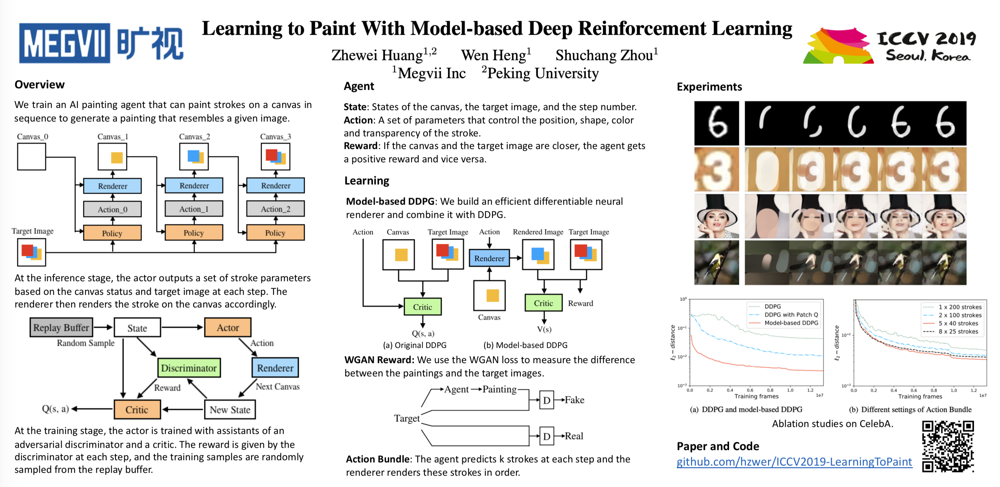
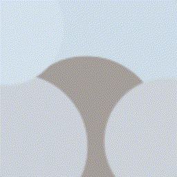
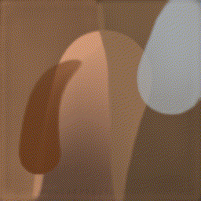

# AI Agent as a Painter

  

## Abstract

- To teach AI to draw any painting like human, who can use a small number of strokes to create masterpiece paintings.

- With the support of a **neural
renderer**, the agent can learn to:
    - determine the **position** and **color** of each stroke;
    - make **long-term plan** to decompose texture-rich images into sequence of strokes. 

- Experiments demonstrate that
masterpiece visual quality can be achieved using only hundreds of strokes. 

- The training process does not require any ~~supervised data~~. 

## Demo

 🠊 

    
More samples

    
    
    
    
    

## Model Weights

📺 Resolution of result is **512**. For higer resolution, please wait for future improvement.

⚠️ Remember to rename the checkpoints to **renderer.pkl** and **actor.pkl** and save them to the corresponding folder (e.g. `checkpoints/default`)

- **default** stroke: [renderer.pkl](https://drive.google.com/open?id=1-7dVdjCIZIxh8hHJnGTK-RA1-jL1tor4) and [actor.pkl](https://drive.google.com/open?id=1a3vpKgjCVXHON4P7wodqhCgCMPgg1KeR)

- **triangle** stroke: [renderer.pkl](https://drive.google.com/open?id=1YefdnTuKlvowCCo1zxHTwVJ2GlBme_eE) and [actor.pkl](https://drive.google.com/open?id=1k8cgh3tF7hKFk-IOZrgsUwlTVE3CbcPF)

- **circle** stroke: [renderer.pkl](https://drive.google.com/open?id=1kI4yXQ7IrNTfjFs2VL7IBBL_JJwkW6rl) and [actor.pkl](https://drive.google.com/open?id=1ewDErUhPeGsEcH8E5a2QAcUBECeaUTZe)

- **curve** stroke: [renderer.pkl](https://drive.google.com/open?id=1XUdti00mPRh1-1iU66Uqg4qyMKk4OL19) and [actor.pkl](https://drive.google.com/open?id=1VBtesw2rHmYu2AeJ22XvTCuzuqkY8hZh)

## Features in Future

✅ Code Restructure 

⬜ Simple GUI

⬜ Retrain with high resolution (1024, 2048, 4096)

⬜ Motion Path with Drawing Hand ([video](https://youtu.be/QQyag99u1sk))

⬜ Tool Control (MS Paint, ...)

## Reference

