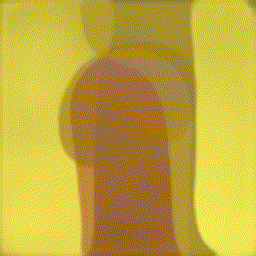
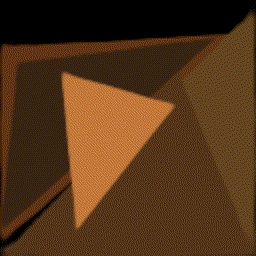

# AI Agent as an Artist

## Abstract

- To teach AI to draw any painting like human, who can use a small number of strokes to create masterpiece paintings.

- Experiments demonstrate that
masterpiece visual quality can be achieved using only hundreds of strokes. 

- The training process does not require any ~~supervised data~~. 

## Demo

### Paint Learner with DRL

 🠊 

  
More samples

  
  
  
  
  

### Paint Transformer

<video controls>
  <source src="./assets/PaintTransformer/1.mp4" type="video/mp4">
</video>

  
More samples

  <video controls>
    <source src="./assets/PaintTransformer/2.mp4" type="video/mp4">
  </video>
  <video controls>
    <source src="./assets/PaintTransformer/3.mp4" type="video/mp4">
  </video>

## Model Weights

🖼️ Resolution of result is **512**. 

🏋️‍♂️ For higer resolution, please wait for future improvement.

### Paint Learner with DRL

- **default** stroke: [renderer.pkl](https://drive.google.com/open?id=1-7dVdjCIZIxh8hHJnGTK-RA1-jL1tor4) and [actor.pkl](https://drive.google.com/open?id=1a3vpKgjCVXHON4P7wodqhCgCMPgg1KeR)

- **triangle** stroke: [renderer.pkl](https://drive.google.com/open?id=1YefdnTuKlvowCCo1zxHTwVJ2GlBme_eE) and [actor.pkl](https://drive.google.com/open?id=1k8cgh3tF7hKFk-IOZrgsUwlTVE3CbcPF)

- **circle** stroke: [renderer.pkl](https://drive.google.com/open?id=1kI4yXQ7IrNTfjFs2VL7IBBL_JJwkW6rl) and [actor.pkl](https://drive.google.com/open?id=1ewDErUhPeGsEcH8E5a2QAcUBECeaUTZe)

- **curve** stroke: [renderer.pkl](https://drive.google.com/open?id=1XUdti00mPRh1-1iU66Uqg4qyMKk4OL19) and [actor.pkl](https://drive.google.com/open?id=1VBtesw2rHmYu2AeJ22XvTCuzuqkY8hZh)

### Paint Transformer

- **template** stroke: [Paddle](https://drive.google.com/file/d/1G0O81qSvGp0kFCgyaQHmPygbVHFi1--q/view?usp=sharing) / [PyTorch](https://drive.google.com/file/d/1NDD54BLligyr8tzo8QGI5eihZisXK1nq/view?usp=sharing)

## Features in Future

✅ Code Restructure

⬜ Retrain with high resolution

  - ⬜ 1024

  - ⬜ 2048

⬜ Brushstroke styles

  - ✅ Triangle

  - ✅ Circle

  - ✅ Curve (Bézier)

  - ⬜ ...

⬜ Simple GUI

⬜ Motion Path with Drawing Hand ([video](https://youtu.be/QQyag99u1sk))

⬜ Tool Control

  - ⬜ MS Paint

## Reference

1. Learning to Paint with **Model-based Deep Reinforcement Learning** ([Paper](https://arxiv.org/pdf/1903.04411) | [Code](https://github.com/hzwer/ICCV2019-LearningToPaint) | [Demo](https://replicate.com/hzwer/iccv2019-learningtopaint)) 

2. **Paint Transformer**: Feed-Forward Neural Painting with *Stroke Prediction* ([Paper](https://arxiv.org/abs/2108.03798) | [Code/Paddle](https://github.com/wzmsltw/PaintTransformer) | [Code/Torch](https://github.com/Huage001/PaintTransformer) | [Demo](https://huggingface.co/spaces/akhaliq/PaintTransformer))

3. Learning to Generate **Line Drawings** that convey *Geometry* and *Semantics* ([Paper](https://arxiv.org/abs/2203.12691) | [Code](https://github.com/carolineec/informative-drawings) | [Demo](https://github.com/carolineec/informative-drawings))
